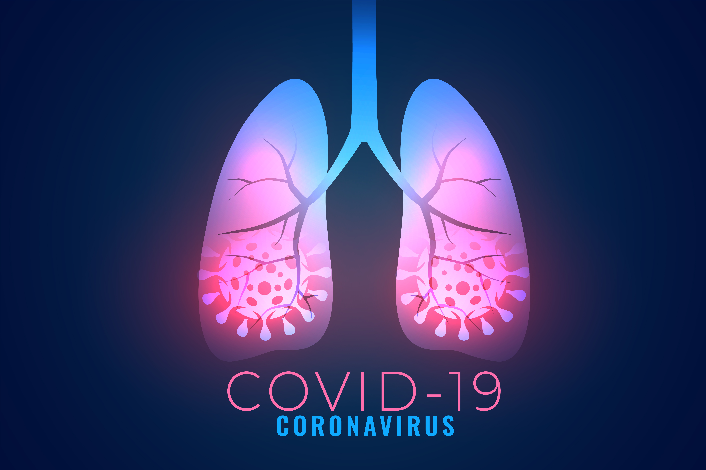
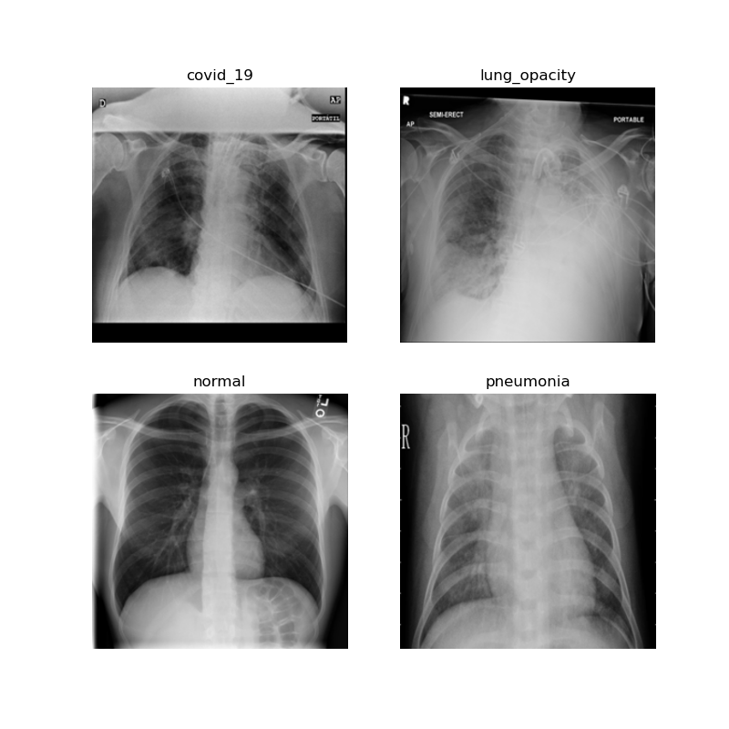
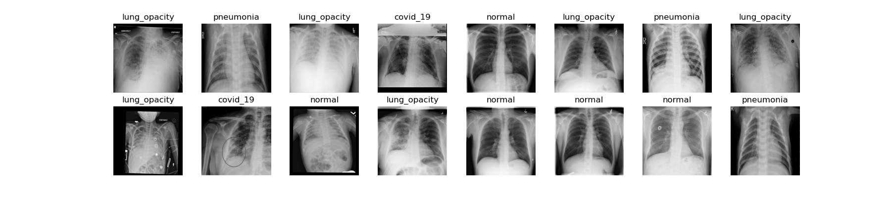
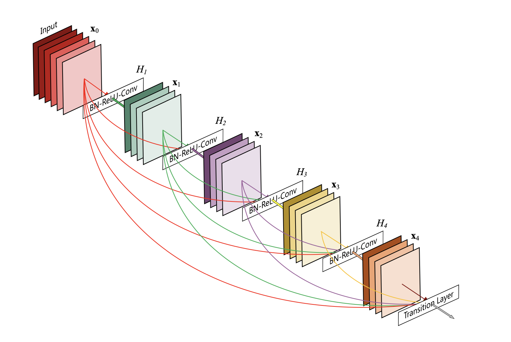
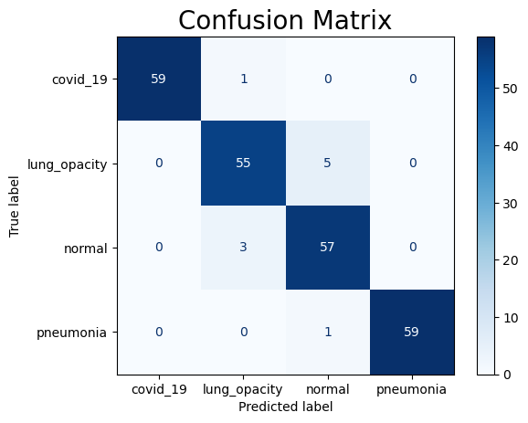
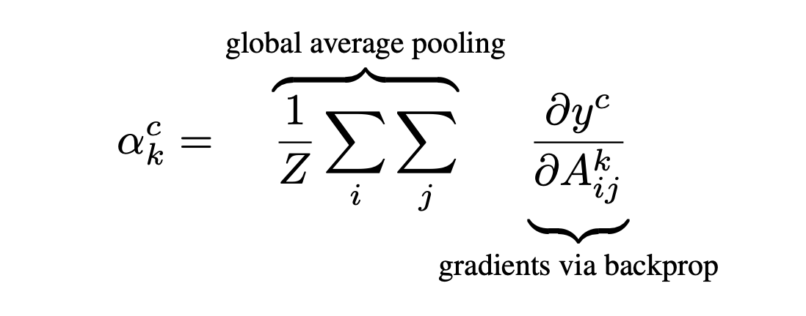
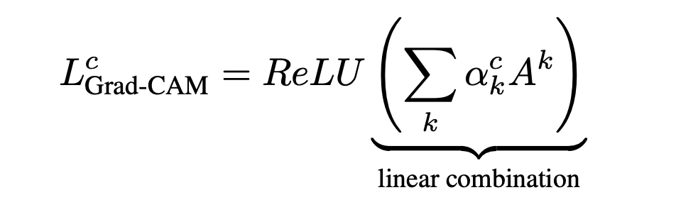
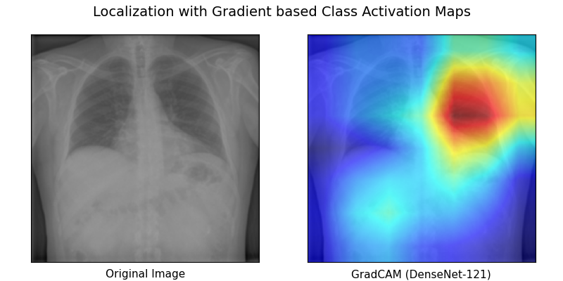
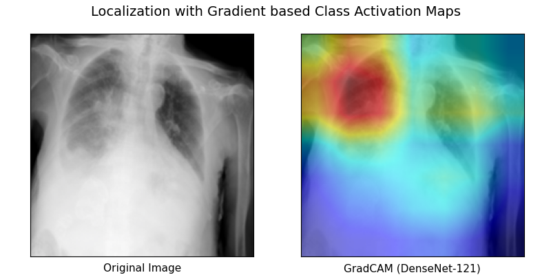
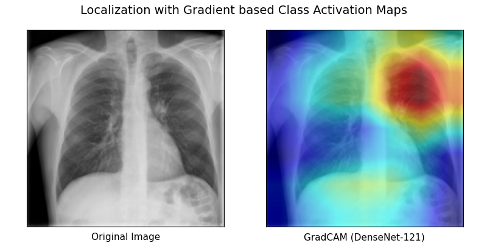

# Enter GradCAM, Interpretable AI for Computer Vision Models


- Deep learning models in computer vision often lack interpretability due to their complex architecture and internal workings.

- Making AI more interpretable is crucial especially in healthcare, where professionals should be able to explain the factors driving the decision of a model.

- This is my implentation of **GradCAM** [[1]](https://arxiv.org/pdf/1610.02391.pdf) in `PyTorch`, an AI visualization technique that uses a technique called “gradient-weighted class activation mapping” (GradCAM) to interpret medical images. 

<p align="center">
 
</p>


## Contents
- [What is GradCAM](#what-is-gradcam)
- [Model used: Densenet121](#model-used-densenet121)
- [Results](#results)
- [Some examples](#some-examples)
- [Usage](#usage)
- [Conclusion](#conclusion)
- [References](#references)


## What is GradCAM?

- GradCAM is a step toward interpretable AI in Computer Vision. It is a visualization technique used in Computer Vision that allows users to understand which parts of an image are driving the model's decision.

- For example if we have an image of lungs, and the model predicts that the patient has a pneumonia, we want to know which part of the image is most likely responsible for this decision. GradCAM will highlight those areas in the image.

- The main idea is to look at the gradient in the final layers of a CNN to identify the zones which drove the model's decision

> For more technical details on this algorithm, see section [Results](#results)


## Dataset

 - We will use the kaggle dataset **COVID-19 Radiography Database** [[2]](https://www.kaggle.com/c/kaggle-survey-2019), which is a set of annotated chest X-ray images for COVID-19 positive cases along with Normal and Viral Pneumonia images.
 - This dataset was assembled by team of researchers from Qatar University, Doha, Qatar, and the University of Dhaka, Bangladesh along with their collaborators from Pakistan and Malaysia in collaboration with medical doctors.
 
Some samples of the dataset:

<p align="center">
 
</p> 

<p align="center">
 
</p> 

 
 
 

## Model used Densenet121

- I used DenseNet-121, deep neural network architecture for computer vision tasks introduced in the paper "Densely Connected Convolutional Networks" by Gao Huang et al. in 2016. [[3]](https://arxiv.org/abs/1608.06993)

- The key idea behind DenseNet-121 is to connect all layers in the network through dense connections, where each layer is connected to all other layers in a feedforward manner. This allows for feature reuse and makes the network more efficient, as the feature maps produced by earlier layers can be directly reused by later layers.

- DenseNet-121 "only" has `7 Million` parameters, and performs better than much larger models (VGG-16 and ResNet-18, with `138 Million` and `11.17 Million` parameters respectively)


<p align="center">
 
</p> 


## Results

Let's first check the accuracy of our model by printing the confusion matrix:

<p align="center">
 
</p> 

A fine-tuned `DenseNet-121` achieves `95.83% accuracy`, not bad!

- Convolutional Layers naturally retain the **spatial information** which is lost in fully-connected layers. Intuitively we expect the last convolutional layers to have the best promise between high-level semantics and detailed spatial information.

- Grad-CAM uses the gradient flowing in the last convolutional layer to assign importance values to each neuron, noted $\alpha_{k}^{c}$ , for any model's decision (classification in our case).


<p align="center">
 
</p> 

- We apply a ReLU to the linear combination of maps because we are only interested in the feature that have a **positive influence** on the class of interest, i.e pixels whose intensity should be increased in order to increase $y^c$


<p align="center">
 
</p> 

- We then normalize all the values in the grid with a min-max normalization, and plot the tensor with a heatmap.

- Remark: At the end we in fact have a 7x7 heatmap, but the original image is 224x224, so how do we go back to the original image?

Each of the pixel in the 7x7 heatmap is like a patch from the original image, so we resize the small heatmap in a picture with higher pixel density with the `cv2.resize` function.


### Some examples

<p align="center">
 
</p> 

<p align="center">
 
</p> 

<p align="center">
 
</p> 


## Usage

 - Clone the repository
 ```bash
 git clone 'git@github.com:FrancoisPorcher/grad-CAM.git' 
 ```
 - Install dependencies
 ```bash
 pip install -r requirements.txt
 ```
 - Run the `main` file! Nothing else to do! (But feel free to explore the other files)
 ```bash
 main.ipynb
 ```


## Conclusion

This is my implementation of Grad-CAM  to better interpret the predictions of CNNs on medical images. 
Feel free to reach out to me!


## References
> - [1] David L. Smith, John-Paul Grenier, Catherine Batte, and Bradley Spieler. [A Characteristic Chest Radiographic Pattern in the Setting of the COVID-19 Pandemic](https://pubs.rsna.org/doi/10.1148/ryct.2020200280). Radiology: Cardiothoracic Imaging 2020 2:5.
> - [2] Hyun Jung Koo, Soyeoun Lim, Jooae Choe, Sang-Ho Choi, Heungsup Sung, and Kyung-Hyun Do. [Radiographic and CT Features of Viral Pneumonia](https://pubs.rsna.org/doi/10.1148/rg.2018170048). RadioGraphics 2018 38:3, 719-739.
> - [3] Tawsifur Rahman, Muhammad Chowdhury, Amith Khandakar. [COVID-19 Radiography Database](https://www.kaggle.com/tawsifurrahman/covid19-radiography-database). Kaggle.
> - [4] Karen Simonyan, Andrew Zisserman. [Very Deep Convolutional Networks for Large-Scale Image Recognition](https://arxiv.org/abs/1409.1556). arxiv:1409.1556v6.
> - [5] Kaiming He, Xiangyu Zhang, Shaoqing Ren, Jian Sun. [Deep Residual Learning for Image Recognition](https://arxiv.org/abs/1512.03385). arxiv:1512.03385v1.
> - [6] Gao Huang, Zhuang Liu, Laurens van der Maaten, Kilian Q. Weinberger. [Densely Connected Convolutional Networks](https://arxiv.org/abs/1608.06993). arxiv:1608.06993v5.
> - [7] Deng, J. et al., 2009. [Imagenet: A large-scale hierarchical image database. In 2009 IEEE conference on computer vision and pattern recognition](http://image-net.org/). pp. 248–255.
> - [8] Ramprasaath R. Selvaraju, Michael Cogswell, Abhishek Das, Ramakrishna Vedantam, Devi Parikh, Dhruv Batra. [Grad-CAM: Visual Explanations from Deep Networks via Gradient-based Localization](https://arxiv.org/abs/1610.02391). arXiv:1610.02391v4.
